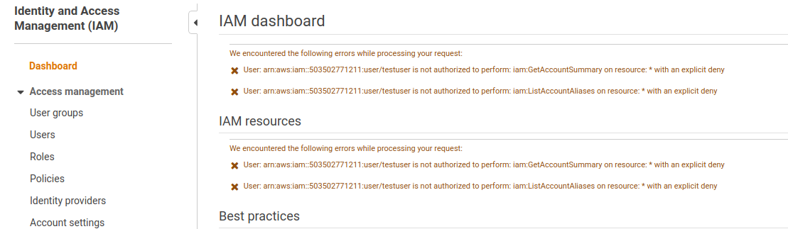
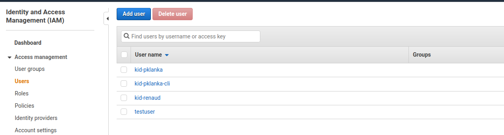
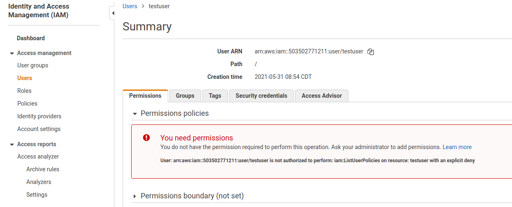
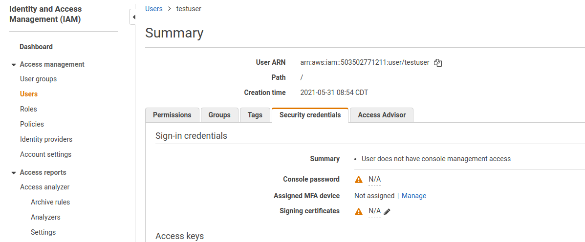
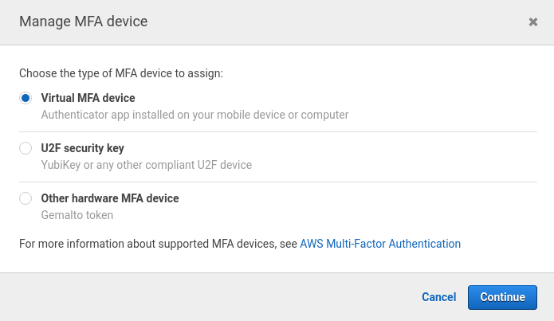
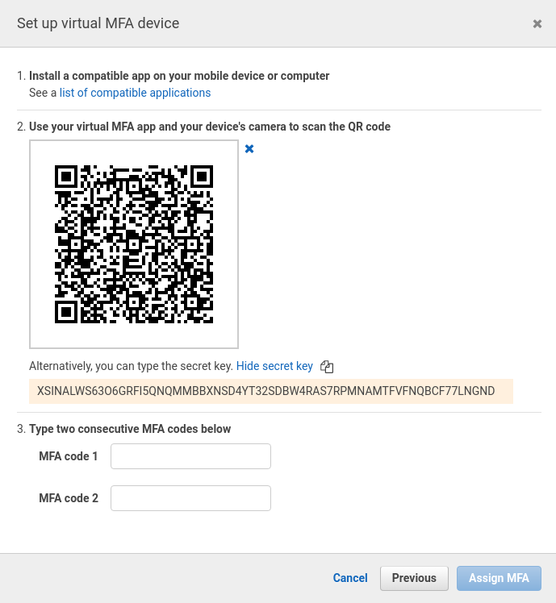
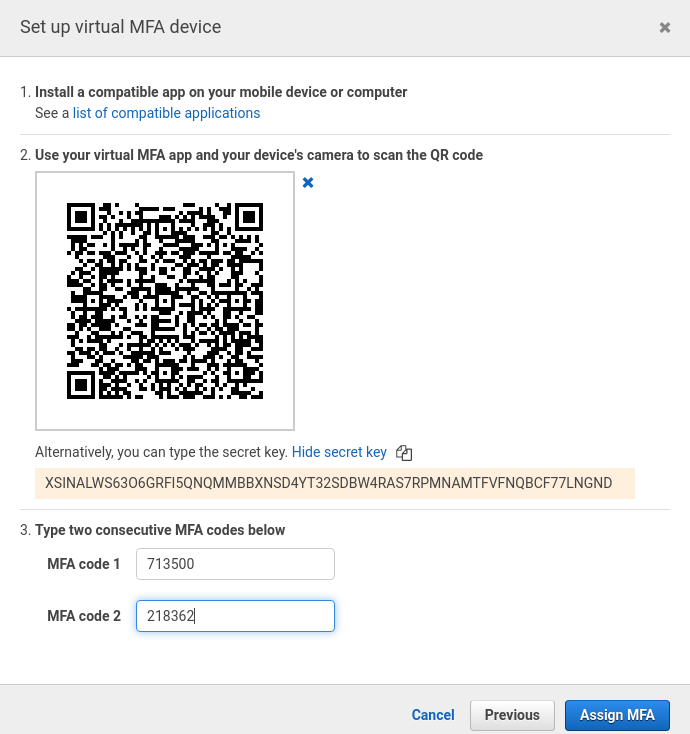
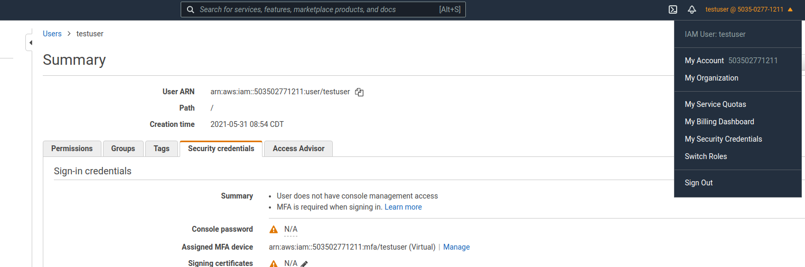
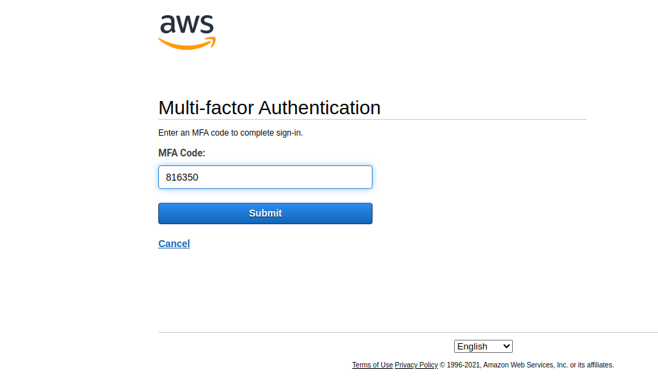
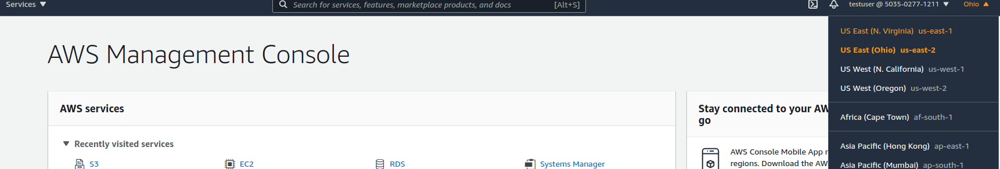

# KID - AWS Account Setup Instructions

This document provides step by step instructions to access KID AWS account. Please reach out to the authors for any queries on the document or any of the steps.

## Accessing Console

This section below helps setting up the password and OTP to access KID AWS account - 

1. List of prerequisites for the console access are provided below - 
   * AWS account number
   * AWS IAM username
   * AWS IAM password

2. Access [AWS Console](https://aws.amazon.com/) and click *Sign In To The Console*.

3. You would need to sign in as a IAM user. In the page to Sign in as IAM user, provide your assigned AWS IAM username and AWS IAM password.

4. If the sign-in is successful you would be prompted to change your password. The new password must meet all of the criteria below - 

>  * Minimum password length is 12 characters
>  * Require at least one uppercase letter from Latin alphabet (A-Z)
>  * Require at least one lowercase letter from Latin alphabet (a-z)
>  * Require at least one number
>  * Require at least one non-alphanumeric character (! @ # $ % ^ & * ( ) _ + - = [ ] { } | ')
>  * Password expires in 90 day(s)
>  * Remember last 5 password(s) and prevent reuse 

5. If the new password is accepted, you would be successfully logged into the console. Now go to IAM console. Without MFA, the user would not have access to anything. It is customary to see error messages while IAM page in AWS console is loading.



6. Click the link Users. IAM users for the accuont would now load. Click on the own user account. Again, it is customary to see lot of errror messages.





7. Click on *Security Credentials* tab in the user account. Click on *Manage* hyperlink next to *Assigned MFA Device*.



8. A new popup will open. Select *Virtual MFA Device* and click *Continue*.  



9. In the subsequent screen, click *Show QR Code* to display the QR code and *Show secret key* to display the secret key. Before you proceed, please copy the secret key and store it in a secure place. We would be using this for CLI based access in future.



10. You can use any MFA app in your mobile for second factor of authentication. Better performing apps are *Authy* or *Google Authenticator*. Take a snapshot of QR code from either of the apps in the smart phone. If everything is successful, you would start seeing the MFA codes come into the app. Provide two successive MFA codes in the screen below.



11. The MFA setup is now successful. Now sign off the AWS console. Close the browser. Open it again and login back to AWS console.



12. This time you would be asked to provide the MFA code and the code is available in the Mobile app. Using the code login to the AWS console to have complete admin access. The region where application is deployed is *us-east-1 - Virginia*. Change region if needed to access the application.





## Accessing CLI

This section below helps setting up the CLI access to the AWS console. The scripts would start to run.  

1. List of prerequisites for the console access are provided below - 
   * Completed set up of AWS console access in the previous section
   * AWS IAM Access Key
   * AWS IAM Secret
   * AWS MFA secret noted down in step# 9 in previous section
   * Python3 must be installed and binaries of python and pip must be within the path
   * Install AWS CLI v2 from [here](https://docs.aws.amazon.com/cli/latest/userguide/install-cliv2.html)
   * The executable `aws` must be available in your path before beginning the next step
   * Installed docker package for your OS and command docker must be in the path

2. Ensure that `python` executable your PATH using the commands below (for respective OS).

```bash
export PATH="</opt/pythonlocation>:$PATH"
```

```bat
setx “%path%;<C:\PythonLocation>”
```

3. Install *pyotp* python module using the below command.

```bash
pip install pyotp
```

4. Create a directory *.aws* in user home directories for the OS selected. For Unix the location for this directory is `~/.aws` and for Windows this directory is `%USERPROFILE%\.aws`

5. Create a file `credentials` in the `.aws` directory. Fill the credentials with the following content. The content in `<>` brackets is a placeholder to fill for this account.

```
[kid-src]
aws_access_key_id = <Copy your value of aws_access_key_id here without quotes>
aws_secret_access_key = <Copy your value of aws_secret_key here without quotes>
```

6. Create a file `config` in the `.aws` directory. Fill the config with the following content. The content in `<>` brackets is a placeholder to fill for this account.

```
[kid-src]
cli_pager = 
output = json
mfa_serial = arn:aws:iam::503502771211:mfa/<AWS IAM username>
mfa_secret = <Paste the value of MFA secret from step#9 here>
region = us-east-1

[profile kid]
cli_pager =
output = json
source_profile = kid-src
region = us-east-1
```

7. Execute the following command to install pyotp package.
```bash
pip3 install pyotp --user
```

8. Executing `python aws-login.py` would now show an error below -

> Need named profile

9. Now you can login to the console by executing the command - 

```bash
python aws-login.py kid
```

10. Every AWS command would now require a additional profile parameter `--profile kid` for successful authentication.

```bash
aws --profile kid s3 ls
```

## Contributing
Pull requests are welcome. For major changes, please discuss what you would like to change.

Please make sure to update tests as appropriate.
